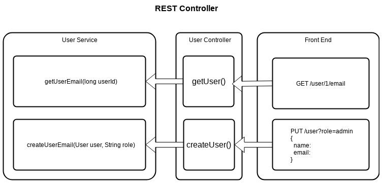
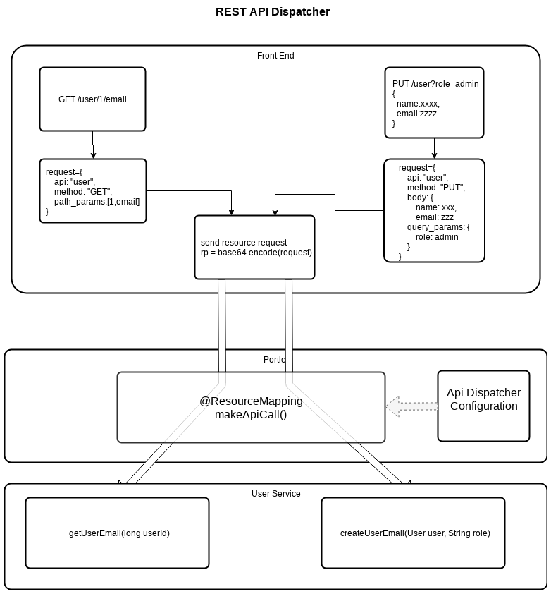

# Rest API Dispatcher

This is the set of libraries for REST API dispatching and tunnelling via JSR 268 Resource Call.

## Prefase

Liferay is a very powerful engine with lots of features but currently it missing the support for SPA BUT it capable execute any HTML/CSS/JavaScript code, 

From other hand modern SPA based on REST Api backend and AJAX calls which Liferay does not support out of the box (REST Api Spec) BUT it capable respond 
on any Resource based request and only via GET or POST calls.

## Implementation
***FROM***

***TO***

## Solution explanation TL;DR
The provided solution is packing all API request including Method, Path, Query, Body and even Upload File into single string on client side, encode this string with BASE64, 
for example, and posting to same Resource endpoint via POST request.

On server side there is reverse process happening and based on internally defined configuration it dynamically invoke one or another method from attached service libraries.

Rest API Dispatcher library is backend part that parse request, apply previously defined configuration and dynamically invokes required method with parameters from request.

Example of client side library located in RestApiDispatcherDemo/DemoRestApiPortlet project

## Project Structure

- **ApiDispatcher** Base REST API Dispatcher Library. The form name for submitted API Request by default is "rp" but can be changed by calling 
setReqParamName(String reqParamName) method.
- **ApiDispatcherPortletFile** Extending ApiDispatcher library by adding single file upload support. The form name for upload file parameter by default is "file" 
but can be changed by calling setFileParamName(String fileParamName) method

## Current limitations

Only one file per call supported for upload.
